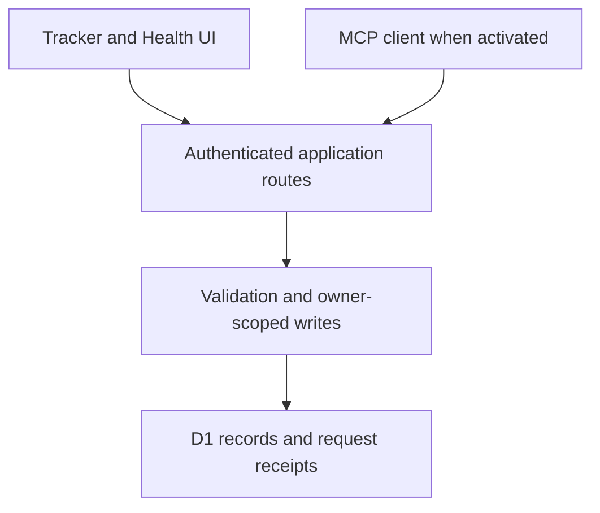

# Architecture

## Request flow

The authentication gateway sits outside the application. Each route resolves the user server-side before passing an owner ID to storage or command handlers. The MCP client path is implemented but remains gated by hosting-account activation.

## Code map

| Path | Responsibility |
| --- | --- |
| `app/tracker.tsx` | Main tracker screens, forms, chart views and copy-review flow. |
| `app/health/health-sync.tsx` | Health transfer input, preview, field selection, receipts and setup guide. |
| `app/api/data/route.ts` | Authenticated tracker reads and commands. |
| `app/api/health/route.ts` | Authenticated Health preview, import and receipt history. |
| `app/mcp/route.ts` | Authenticated remote MCP entry point. |
| `app/chatgpt-auth.ts` | Sites identity and safe sign-in return paths. |
| `lib/metrics.ts`, `lib/analysis.ts` | Metric definitions, UK dates, aggregations and reviews. |
| `lib/validation.ts`, `lib/writes.ts` | Validation and revision-guarded UI commands. |
| `lib/coach-tools.ts`, `lib/mcp.ts` | MCP tools, protocol handling and durable write receipts. |
| `lib/health.ts`, `lib/health-server.ts` | Health parsing, units, sleep intervals and transactional imports. |
| `lib/storage.ts` | Owner-scoped D1 reads and writes. |
| `db/schema.ts`, `drizzle/` | Schema definitions and migration history. |
| `build/sites-vite-plugin.ts` | Vendored Sites build integration and loopback-only development sign-in. |

## Tables

| Table | Key | Stored information |
| --- | --- | --- |
| `daily_entries` | owner + date | Daily values, meals, exercise sets, notes and revision. |
| `preferences` | owner | Targets, exam settings and revision. |
| `habits` | owner + habit ID | Habit name, creation date and archive state. |
| `habit_logs` | owner + habit ID + date | Daily habit completion. |
| `tool_requests` | owner + request ID | MCP argument fingerprint and durable result. |
| `health_imports` | owner + request ID | Selected Health readings, source labels and result. |

Payloads are JSON stored inside relational ownership and revision boundaries. This supports evolving personal metrics without a column per field, at the cost of less direct SQL analytics. Common history lookups use owner-first keys; Health receipts have an owner/date index.

## Write behaviour

The browser edits a versioned day. A stale version rejects rather than overwrites newer data. MCP commands and Health imports merge the requested fields server-side. Their receipt and associated data write commit in a single guarded D1 batch. Reusing a request ID with identical validated arguments returns the stored result; different arguments conflict.

The UI refreshes on return to its tab and retains revision protection for forms already open. It does not implement realtime streaming updates.

## Deployment boundary

The trusted Sites gateway injects `oai-authenticated-user-*` headers. These headers alone are not credentials when supplied by an arbitrary client. A host outside Sites must establish an equivalent trusted boundary or replace the auth adapter. Application-level owner filtering cannot compensate for forged identity at the gateway.
